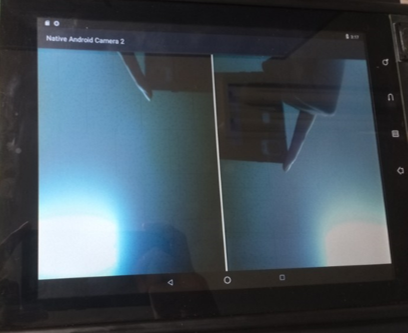

Android NDK Camera Preview
=============
This is an Android NDK camera preview sample code.

Pre-requisites
--------------
- Android Studio 2.1+ with [NDK](https://developer.android.com/ndk/) (>=r12) bundle.

Screenshots
-----------
Two layouts were used to show captured images of each camera.

